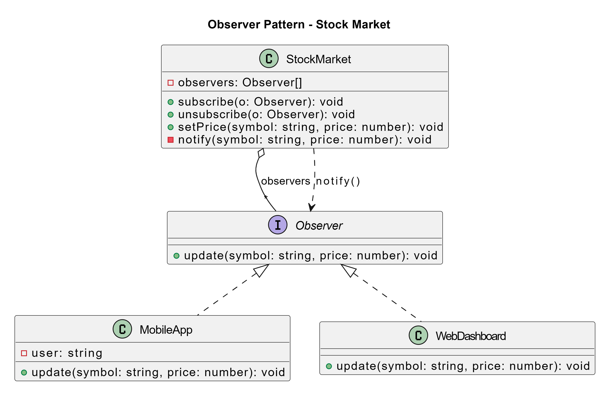
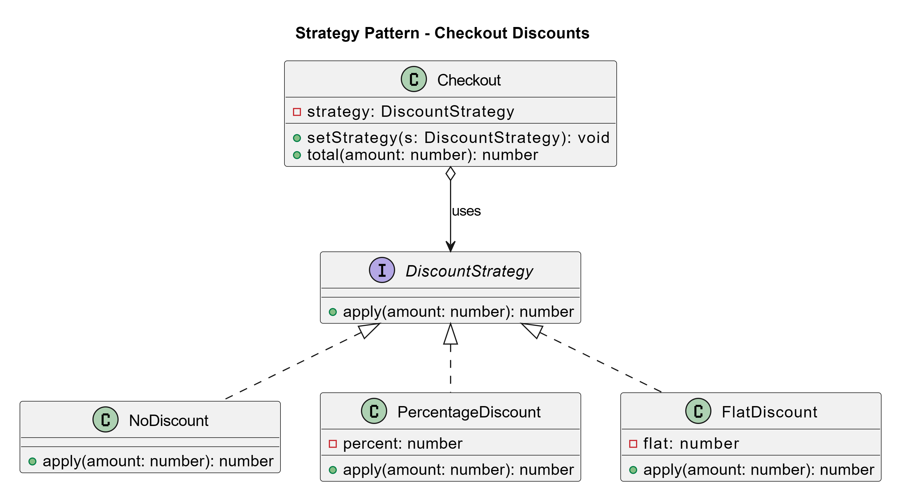
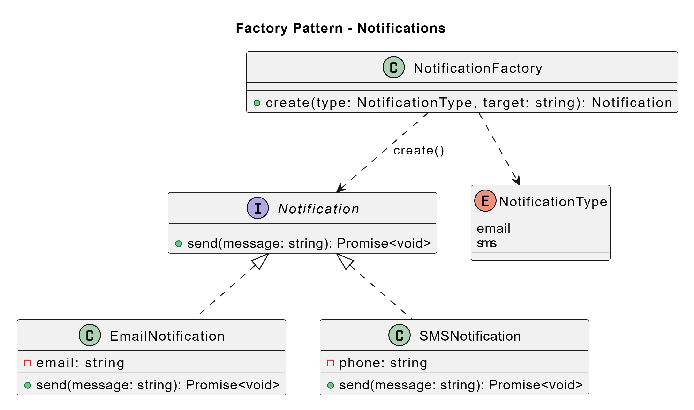
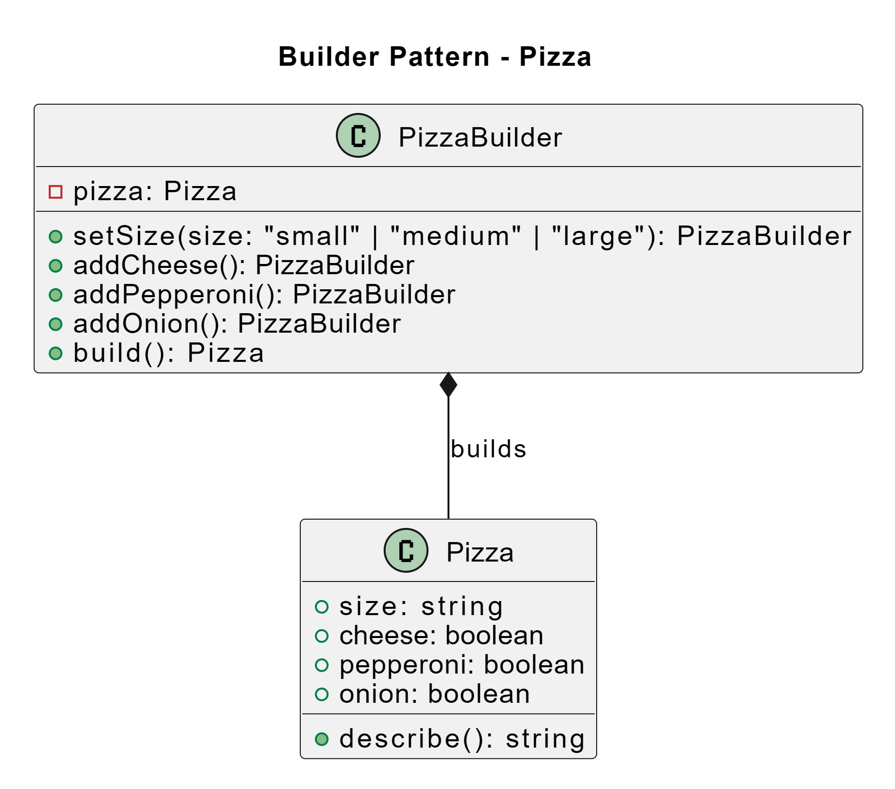
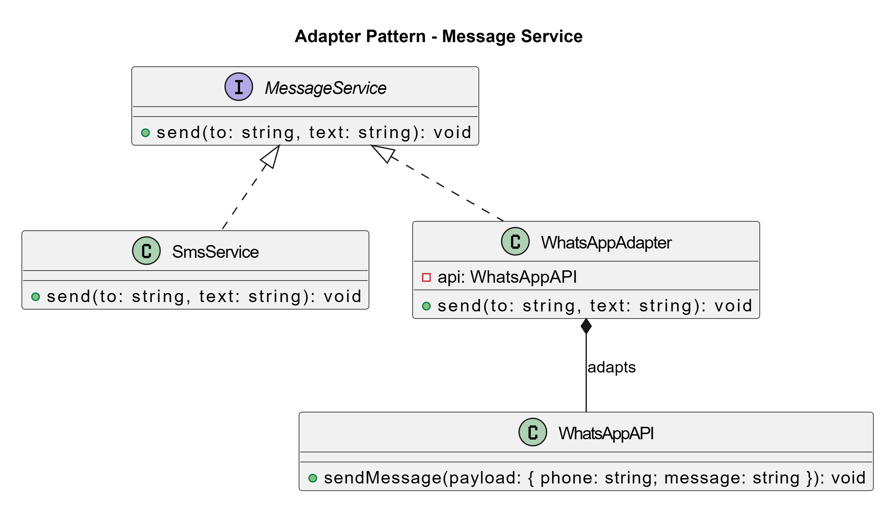
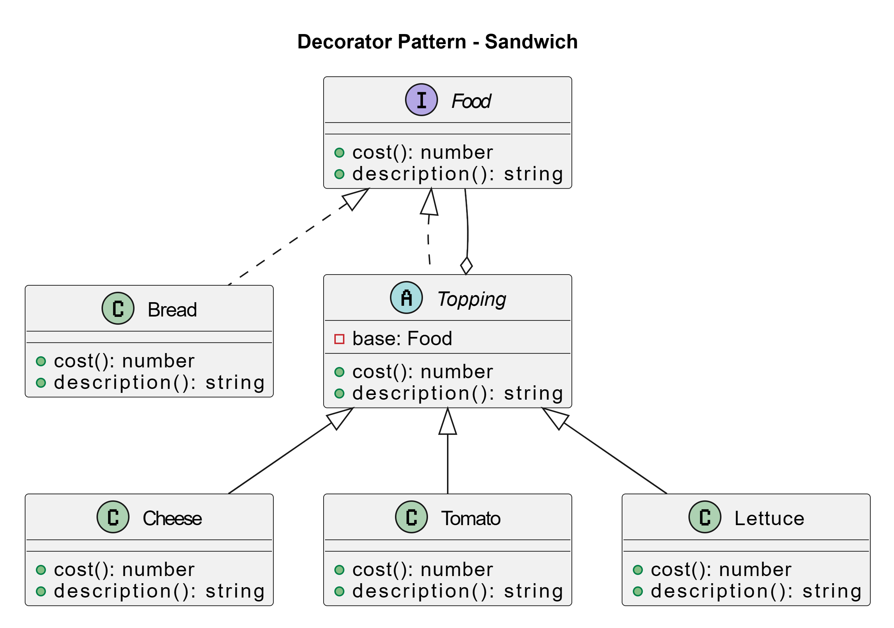
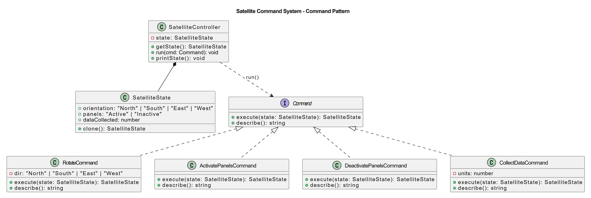

# Task 1: Design Patterns Demo (TypeScript)

## Introduction

This repository demonstrates six classic software design patterns implemented in TypeScript. Each example is mapped to a small, realistic use case to make the intent of the pattern easy to understand and reuse.

## Design Patterns Implemented

The project covers the following patterns and use-cases:

1. Behavioral Patterns
	 - Observer Pattern — Stock market price notifications
		
	 - Strategy Pattern — Checkout discount strategies (none, percentage, flat)
		

2. Creational Patterns
	 - Factory Pattern — Notification service factory (Email, SMS)
		
	 - Builder Pattern — Pizza builder
		

3. Structural Patterns
	 - Adapter Pattern — Unifying WhatsApp API and SMS under a common interface
		
	 - Decorator Pattern — Sandwich with toppings (cheese, tomato, lettuce)
		

## Features

- Implementations written in TypeScript with strict typing
- Clear, modular folder structure mirroring each pattern
- Interactive console menu to run each demo
- Extensible design so new variants can be added with minimal changes

## Getting Started

1. Prerequisites
	 - Node.js 18+ and npm

2. Install dependencies
	 ```cmd
	 npm install
	 ```

3. Run in development (ts-node)
	 ```cmd
	 npm start
	 ```

4. Or build and run compiled output
	 ```cmd
	 npm run build
	 node dist/src/index.js
	 ```

## Usage

When you run the app, you’ll see a menu like this:

```
=== Design Patterns Demo ===
1. Factory Pattern
2. Builder Pattern
3. Observer Pattern
4. Strategy Pattern
5. Adapter Pattern
6. Decorator Pattern
7. Satellite Command System (Exercise 2)
Type 'exit' to quit
Enter your choice:
```

Pick a number to execute that demo. The program loops until you type `exit`.

# Task 2: Satellite Command System (Mini Project)

## Overview
Console-based simulation of a satellite with commands to rotate, control solar panels, and collect data. Built with the Command pattern and a clean, explicit state model.

### Module Structure
- `Task_2/satellite/domain/state.ts` — SatelliteState, Orientation, PanelStatus
- `Task_2/satellite/commands/*.ts` — Command interface and concrete commands
- `Task_2/satellite/controller/controller.ts` — SatelliteController (invoker)
- `Task_2/satellite/cli/runner.ts` — Interactive CLI (runSatelliteCli)

## Commands
- `rotate <North|South|East|West>` — sets orientation
- `activatePanels` — sets panels to Active
- `deactivatePanels` — sets panels to Inactive
- `collectData [units]` — increments data (default +10) only when panels are Active
- `exit` — leave the Satellite CLI

## How to Run the Satellite CLI

From the main menu, choose option `7`. Alternatively, you can import and call `runSatelliteCli()` from `Task_2/satellite/satellite.ts` in your own entry script.

### Class Diagram


## Technologies Used
- TypeScript, Node.js (console-based; no UI)
- Design Patterns: Factory, Builder, Observer, Strategy, Adapter, Decorator, Facade, Command
- SOLID principles, modular architecture

---

Created for EI Assignment